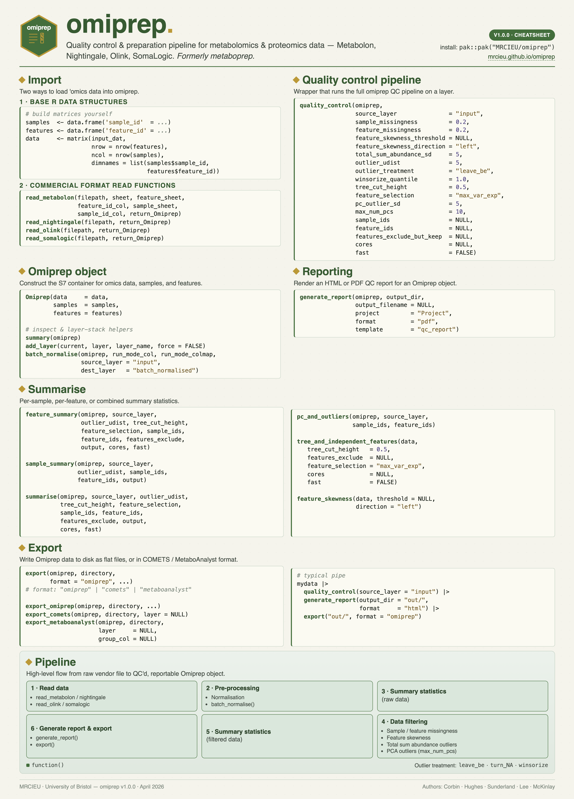

<!-- README.md is generated from README.Rmd. Please edit that file -->

```{r, include = FALSE}
knitr::opts_chunk$set(
  collapse = TRUE,
  comment = "#>",
  fig.path = "man/figures/README-",
  out.width = "100%"
)
```

# omiprep 
<p align="center">  </p>
<!-- badges: start -->
[](https://lifecycle.r-lib.org/articles/stages.html#experimental)
[](https://github.com/MRCIEU/omiprep/actions/workflows/R-CMD-check.yaml)
[](https://doi.org/10.5281/zenodo.20941283)
<!-- badges: end -->


The goal of `omiprep` is to:  

1. Read in and processes various 'omics data, saving datasets in tab-delimited format for use elsewhere
2. Provide useful summary data in the form of tab-delimited text file and a html report.  
3. Perform data filtering on the data set using a standard pipeline and according to user-defined thresholds.  


## Installation

You can install the latest version of omiprep from [GitHub](https://github.com/MRCIEU/omiprep) with:

``` r
# install.packages("pak")
pak::pak("MRCIEU/omiprep")
```

## Cheatsheet



## Example

This is a basic example which shows you how to load data and run the `omiprep` quality control pipeline.

### Read data into R and create the Omiprep object

```{r}
library(omiprep)

# import data 
datain <- read_nightingale(system.file("extdata", "nightingale_v2_example.xlsx", package = "omiprep"), 
                         return_Omiprep = FALSE    ## Whether to return a Omiprep object (TRUE) or a list (FALSE)
                         )

# create omiprep object
mydata <-  Omiprep(data     = datain$data, 
                   features = datain$features, 
                   samples  = datain$samples)

```

### Run the quality control pipeline

```{r example}
# run QC
mydata <- mydata |> quality_control()
```


### View a summary of the Omiprep object

```{r summary}
# view summary
summary(mydata)
```

### Plot a dendrogram of the feature tree

```{r treeplot, fig.alt = "Dendrogram", fig.width = 20, fig.height = 5}
# view feature tree
tree <- attr(mydata@feature_summary, "qc_tree")
indfeatcount = sum( mydata@feature_summary["independent_features", , 2], na.rm = TRUE )
par(mar = c(2,3,5,1) )
plot(tree, hang = -1, cex = 0.5, 
     main = paste0("Example NH Dataset Feature Tree\n# of ind. features = ",indfeatcount ), 
     xlab = "")
```
