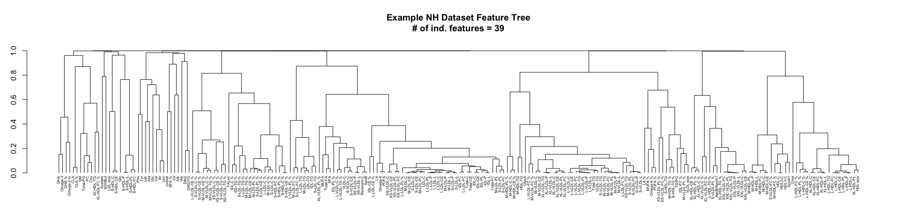

<!-- README.md is generated from README.Rmd. Please edit that file -->

# omiprep

<p align="center">


</p>

<!-- badges: start -->

[](https://lifecycle.r-lib.org/articles/stages.html#experimental)
[](https://github.com/MRCIEU/omiprep/actions/workflows/R-CMD-check.yaml)
[](https://doi.org/10.5281/zenodo.20941283)
<!-- badges: end -->

The goal of `omiprep` is to:

1.  Read in and processes various ’omics data, saving datasets in
    tab-delimited format for use elsewhere
2.  Provide useful summary data in the form of tab-delimited text file
    and a html report.  
3.  Perform data filtering on the data set using a standard pipeline and
    according to user-defined thresholds.

## Installation

You can install the latest version of omiprep from
[GitHub](https://github.com/MRCIEU/omiprep) with:

``` r
# install.packages("pak")
pak::pak("MRCIEU/omiprep")
```

## Cheatsheet


## Example

This is a basic example which shows you how to load data and run the
`omiprep` quality control pipeline.

### Read data into R and create the Omiprep object

``` r
library(omiprep)

# import data 
datain <- read_nightingale(system.file("extdata", "nightingale_v2_example.xlsx", package = "omiprep"), 
                         return_Omiprep = FALSE    ## Whether to return a Omiprep object (TRUE) or a list (FALSE)
                         )

# create omiprep object
mydata <-  Omiprep(data     = datain$data, 
                   features = datain$features, 
                   samples  = datain$samples)
```

### Run the quality control pipeline

``` r
# run QC
<<<<<<< HEAD
mydata <- mydata |> quality_control( source_layer               = "input", 
                                     sample_missingness         = 0.2, 
                                     feature_missingness        = 0.2, 
                                     feature_skewness_threshold = NULL,
                                     feature_skewness_direction = "left",
                                     total_sum_abundance_sd     = 5, 
                                     outlier_udist              = 5, 
                                     outlier_treatment          = "leave_be", 
                                     winsorize_quantile         = 1.0, 
                                     tree_cut_height            = 0.5, 
                                     pc_outlier_sd              = 5, 
                                     sample_ids                 = NULL, 
                                     feature_ids                = NULL)
=======
mydata <- mydata |> quality_control()
>>>>>>> 8c00fb170cff757f4092fa7824470f236a976f74
#> 
#> ── Starting Omics QC Process ───────────────────────────────────────────────────
#> ℹ Validating input parameters
#> ✔ Validating input parameters [4ms]
#> 
#> ℹ Sample & Feature Summary Statistics for raw data
<<<<<<< HEAD
#> AF =  2
#> ✔ Sample & Feature Summary Statistics for raw data [271ms]
#> ℹ Copying input data to new 'qc' data layer✔ Copying input data to new 'qc' data layer [15ms]
#> ℹ Assessing for extreme sample missingness >=80% - excluding 0 sample(s)✔ Assessing for extreme sample missingness >=80% - excluding 0 sample(s) [10ms]
#> ℹ Assessing for extreme feature missingness >=80% - excluding 0 feature(s)✔ Assessing for extreme feature missingness >=80% - excluding 0 feature(s) [10m…
#> ℹ Assessing for sample missingness at specified level of >=20% - excluding 0 sa…✔ Assessing for sample missingness at specified level of >=20% - excluding 2 sa…
#> ℹ Assessing for feature missingness at specified level of >=20% - excluding 0 f…✔ Assessing for feature missingness at specified level of >=20% - excluding 0 f…
#> ℹ Calculating total sum abundance outliers at +/- 5 Sdev - excluding 0 sample(s)✔ Calculating total sum abundance outliers at +/- 5 Sdev - excluding 0 sample(s…
#> ℹ Running sample data PCA outlier analysis at +/- 5 Sdev✔ Running sample data PCA outlier analysis at +/- 5 Sdev [8ms]
=======
#> ℹ Number of informative PCs (Scree acceleration factor): 2
#> ℹ Sample & Feature Summary Statistics for raw data✔ Sample & Feature Summary Statistics for raw data [794ms]
#> 
#> ℹ Copying input data to new 'qc' data layer
#> ✔ Copying input data to new 'qc' data layer [12ms]
#> 
#> ℹ Assessing for extreme sample missingness >=80% - excluding 0 sample(s)
#> ✔ Assessing for extreme sample missingness >=80% - excluding 0 sample(s) [9ms]
#> 
#> ℹ Assessing for extreme feature missingness >=80% - excluding 0 feature(s)
#> ✔ Assessing for extreme feature missingness >=80% - excluding 0 feature(s) [13m…
#> 
#> ℹ Assessing for sample missingness at specified level of >=20% - excluding 0 sa…
#> ✔ Assessing for sample missingness at specified level of >=20% - excluding 0 sa…
#> 
#> ℹ Assessing for feature missingness at specified level of >=20% - excluding 0 f…
#> ✔ Assessing for feature missingness at specified level of >=20% - excluding 7 f…
#> 
#> ℹ Calculating total sum abundance outliers at +/- 5 Sdev - excluding 0 sample(s)
#> ✔ Calculating total sum abundance outliers at +/- 5 Sdev - excluding 0 sample(s…
#> 
#> ℹ Running sample data PCA outlier analysis at +/- 5 Sdev
#> ✔ Running sample data PCA outlier analysis at +/- 5 Sdev [8ms]
#> 
>>>>>>> 8c00fb170cff757f4092fa7824470f236a976f74
#> ℹ Sample PCA outlier analysis - re-identify feature independence and PC outlier…
#> ℹ Number of informative PCs (Scree acceleration factor): 2
#> ℹ Sample PCA outlier analysis - re-identify feature independence and PC outlier…ℹ Sample PCA outlier analysis - re-identify feature independence and PC outlier…
#> ! The stated max PCs [max_num_pcs=10] to use in PCA outlier assessment is greater than the number of available informative PCs [2]
#> ℹ Sample PCA outlier analysis - re-identify feature independence and PC outlier…✔ Sample PCA outlier analysis - re-identify feature independence and PC outlier…
#> 
#> ℹ Creating final QC dataset...
#> ℹ Number of informative PCs (Scree acceleration factor): 2
#> ℹ Creating final QC dataset...
#> ℹ Creating final QC dataset...── Step timings ──
#> ℹ Creating final QC dataset...
#> ℹ Creating final QC dataset...
#>                         step seconds   pct
<<<<<<< HEAD
#>                   validation    0.01   1.2
#>                summarise_raw    0.26  31.7
=======
#>                   validation    0.00   0.0
#>                summarise_raw    0.79  32.9
>>>>>>> 8c00fb170cff757f4092fa7824470f236a976f74
#>                   copy_layer    0.00   0.0
#>   extreme_sample_missingness    0.00   0.0
#>  extreme_feature_missingness    0.01   0.4
#>           sample_missingness    0.00   0.0
#>          total_sum_abundance    0.00   0.0
<<<<<<< HEAD
#>                summarise_pca    0.25  30.5
#>              summarise_final    0.19  23.2
#>                        total    0.82 100.1
#> ✔ Creating final QC dataset... [210ms]
#> ℹ 'Omics QC Process Completed✔ 'Omics QC Process Completed [12ms]
=======
#>                summarise_pca    0.77  32.1
#>              summarise_final    0.73  30.4
#>                        total    2.40 100.0
#> ✔ Creating final QC dataset... [757ms]
#> 
#> ℹ 'Omics QC Process Completed
#> ✔ 'Omics QC Process Completed [9ms]
>>>>>>> 8c00fb170cff757f4092fa7824470f236a976f74
```

### View a summary of the Omiprep object

``` r
# view summary
summary(mydata)
#> Omiprep Object Summary
#> --------------------------
#> Samples      : 150
#> Features     : 229
#> Data Layers  : 2
#> Layer Names  : input, qc
#> 
#> Sample Summary Layers : input, qc
#> Feature Summary Layers: input, qc
#> 
#> Sample Annotation (metadata):
#>   Columns: 7
#>   Names  : sample_id, high_pyruvate, high_lactate, low_glutamine__high_glutamate, plasma_sample, reason_excluded, excluded
#> 
#> Feature Annotation (metadata):
#>   Columns: 3
#>   Names  : feature_id, reason_excluded, excluded
#> 
#> Exclusion Codes Summary:
#> 
#>   Sample Exclusions:
#> Exclusion | Count
#> -----------------
#> user_excluded                     | 0
#> extreme_sample_missingness        | 0
#> user_defined_sample_missingness   | 0
#> user_defined_sample_totalpeakarea | 0
#> user_defined_sample_pca_outlier   | 0
#> 
#>   Feature Exclusions:
#> Exclusion | Count
#> -----------------
#> user_excluded                    | 0
#> extreme_feature_missingness      | 0
#> user_defined_feature_missingness | 7
#> user_defined_feature_skewness    | 0
```

### Plot a dendrogram of the feature tree

``` r
# view feature tree
tree <- attr(mydata@feature_summary, "qc_tree")
indfeatcount = sum( mydata@feature_summary["independent_features", , 2], na.rm = TRUE )
par(mar = c(2,3,5,1) )
plot(tree, hang = -1, cex = 0.5, 
     main = paste0("Example NH Dataset Feature Tree\n# of ind. features = ",indfeatcount ), 
     xlab = "")
```


