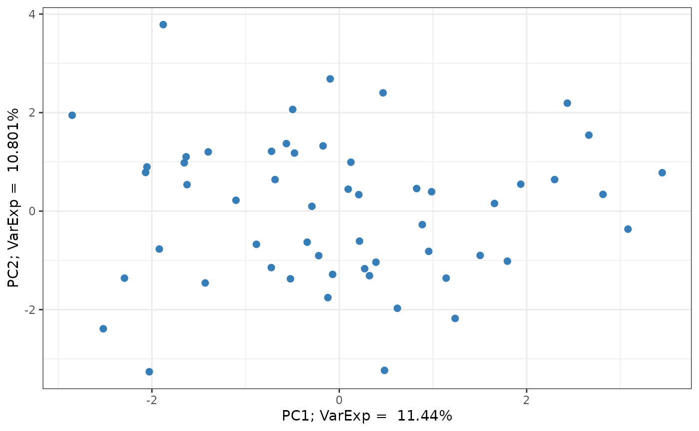
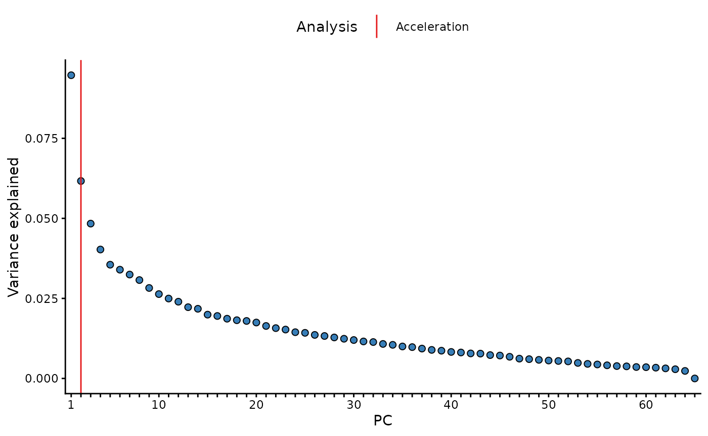

# Sample summary

## Create Omiprep object

``` r

library(omiprep)

# import data
data     <- read.csv(system.file("extdata", "dummy_data.csv", package = "omiprep"), header=T, row.names = 1, check.names = FALSE) |> as.matrix()
samples  <- read.csv(system.file("extdata", "dummy_samples.csv", package = "omiprep"), header=T, row.names = 1)
features <- read.csv(system.file("extdata", "dummy_features.csv", package = "omiprep"), header=T, row.names = 1)
features$feature_id = as.character(features$feature_id)

# create object
mydata <- Omiprep(data = data, samples = samples, features = features)
```

## Summary of Omiprep object

``` r

summary(mydata)
#> Omiprep Object Summary
#> --------------------------
#> Samples      : 125
#> Features     : 253
#> Data Layers  : 1
#> Layer Names  : input
#> 
#> Sample Summary Layers : none
#> Feature Summary Layers: none
#> 
#> Sample Annotation (metadata):
#>   Columns: 10
#>   Names  : sample_id, parent_sample_id, client_identifier, sex, age, bmi, LC.MS.Polar, LC.MS.Neg, LC.MS.Pos.Early, LC.MS.Pos.Late
#> 
#> Feature Annotation (metadata):
#>   Columns: 14
#>   Names  : feature_id, pathway_sortorder, biochemical, super_pathway, sub_pathway, comp_id, platform, chemical_id, ri, mass, cas, pubchem, kegg, group_hmdb
#> 
#> Exclusion Codes Summary:
#> 
#>   Sample Exclusions:
#> Exclusion | Count
#> -----------------
#> user_excluded                     | 0
#> extreme_sample_missingness        | 0
#> user_defined_sample_missingness   | 0
#> user_defined_sample_totalpeakarea | 0
#> user_defined_sample_pca_outlier   | 0
#> 
#>   Feature Exclusions:
#> Exclusion | Count
#> -----------------
#> user_excluded                    | 0
#> extreme_feature_missingness      | 0
#> user_defined_feature_missingness | 0
#> user_defined_feature_skewness    | 0
```

## Run standard quality control

``` r

mydata = quality_control(mydata)
#> 
#> ── Starting Omics QC Process ───────────────────────────────────────────────────
#> ℹ Validating input parameters
#> ✔ Validating input parameters [9ms]
#> 
#> ℹ Sample & Feature Summary Statistics for raw data
#> ℹ Number of informative PCs (Scree acceleration factor): 2
#> ℹ Sample & Feature Summary Statistics for raw data✔ Sample & Feature Summary Statistics for raw data [1.9s]
#> 
#> ℹ Copying input data to new 'qc' data layer
#> ✔ Copying input data to new 'qc' data layer [28ms]
#> 
#> ℹ Assessing for extreme sample missingness >=80% - excluding 0 sample(s)
#> ✔ Assessing for extreme sample missingness >=80% - excluding 0 sample(s) [21ms]
#> 
#> ℹ Assessing for extreme feature missingness >=80% - excluding 0 feature(s)
#> ✔ Assessing for extreme feature missingness >=80% - excluding 5 feature(s) [21m…
#> 
#> ℹ Assessing for sample missingness at specified level of >=20% - excluding 0 sa…
#> ✔ Assessing for sample missingness at specified level of >=20% - excluding 1 sa…
#> 
#> ℹ Assessing for feature missingness at specified level of >=20% - excluding 0 f…
#> ✔ Assessing for feature missingness at specified level of >=20% - excluding 46 …
#> 
#> ℹ Calculating total sum abundance outliers at +/- 5 Sdev - excluding 0 sample(s)
#> ✔ Calculating total sum abundance outliers at +/- 5 Sdev - excluding 0 sample(s…
#> 
#> ℹ Running sample data PCA outlier analysis at +/- 5 Sdev
#> ✔ Running sample data PCA outlier analysis at +/- 5 Sdev [17ms]
#> 
#> ℹ Sample PCA outlier analysis - re-identify feature independence and PC outlier…
#> ℹ Number of informative PCs (Scree acceleration factor): 2
#> ℹ Sample PCA outlier analysis - re-identify feature independence and PC outlier…ℹ Sample PCA outlier analysis - re-identify feature independence and PC outlier…
#> ! The stated max PCs [max_num_pcs=10] to use in PCA outlier assessment is greater than the number of available informative PCs [2]
#> ℹ Sample PCA outlier analysis - re-identify feature independence and PC outlier…✔ Sample PCA outlier analysis - re-identify feature independence and PC outlier…
#> 
#> ℹ Creating final QC dataset...
#> ℹ Number of informative PCs (Scree acceleration factor): 2
#> ℹ Creating final QC dataset...
#> ℹ Creating final QC dataset...── Step timings ──
#> ℹ Creating final QC dataset...
#> ℹ Creating final QC dataset...
#>                         step seconds   pct
#>                   validation    0.00   0.0
#>                summarise_raw    1.79  29.9
#>                   copy_layer    0.00   0.0
#>   extreme_sample_missingness    0.00   0.0
#>  extreme_feature_missingness    0.00   0.0
#>           sample_missingness    0.00   0.0
#>          total_sum_abundance    0.01   0.2
#>                summarise_pca    2.00  33.4
#>              summarise_final    1.88  31.4
#>                        total    5.99 100.0
#> ✔ Creating final QC dataset... [1.9s]
#> 
#> ℹ 'Omics QC Process Completed
#> ✔ 'Omics QC Process Completed [14ms]
```

## Sample Summary

### View sample summary from the QC pipeline

``` r

# Note: the quality_control() ultimately returns the sample_summary attribute as a matrix.
df <- as.data.frame(mydata@sample_summary[1:3, 1:6, "input"])
df <- cbind(sample_id = rownames(df), df)

df |> knitr::kable( digits = 3, row.names = FALSE, align = "c") |>
  kableExtra::kable_styling(full_width = TRUE) 
```

| sample_id | missingness | non_na_feature_count | tsa_total | tsa_complete_features | complete_feature_count | outlier_count |
|:--:|:--:|:--:|:--:|:--:|:--:|:--:|
| sam_1 | 0.111 | 225 | 1124.460 | 430.751 | 88 | 2 |
| sam_2 | 0.123 | 222 | 1074.218 | 414.520 | 88 | 3 |
| sam_3 | 0.146 | 216 | 1057.703 | 421.792 | 88 | 2 |

### Manually run sample summary

While sample summary is run as a part of the quality_control() function
pipeline you can run the function yourself, on any layer you wish.

``` r

# NOTE:
# outlier_udist = number of IQRs from the median at which a value is flagged.
# 1.0 here is illustrative; in practice we favour 5.0, which is the default value
# for the quality_control() function.
sample_sum1 <- sample_summary(omiprep         = mydata, 
                              source_layer    = "input", 
                              outlier_udist   = 1.0,
                              output          = "data.frame")
```

#### Table of sample summary

``` r

sample_sum1 |> 
  head(n = 10) |> 
  knitr::kable( digits = 3, row.names = FALSE, align = "c") |>
  kableExtra::kable_styling(full_width = TRUE) 
```

| sample_id | missingness | non_na_feature_count | tsa_total | tsa_complete_features | complete_feature_count | outlier_count |
|:--:|:--:|:--:|:--:|:--:|:--:|:--:|
| sam_1 | 0.111 | 225 | 1124.460 | 430.751 | 88 | 19 |
| sam_2 | 0.123 | 222 | 1074.218 | 414.520 | 88 | 34 |
| sam_3 | 0.146 | 216 | 1057.703 | 421.792 | 88 | 21 |
| sam_4 | 0.107 | 226 | 1184.763 | 464.685 | 88 | 43 |
| sam_5 | 0.130 | 220 | 1079.019 | 426.939 | 88 | 29 |
| sam_6 | 0.138 | 218 | 1116.860 | 447.960 | 88 | 35 |
| sam_7 | 0.103 | 227 | 1149.438 | 447.185 | 88 | 31 |
| sam_8 | 0.126 | 221 | 1131.554 | 457.195 | 88 | 38 |
| sam_9 | 0.154 | 214 | 1078.960 | 444.311 | 88 | 32 |
| sam_10 | 0.123 | 222 | 925.309 | 316.467 | 88 | 115 |

### Run sample summary on subset

Using the `sample_ids` and `feature_ids` arguments you can run the
summary for a subset of the data. Note: all rows will be return, however
summary data will only be returned for the specified ids.

``` r

## define a vector of sample IDs
sids <- mydata@samples[mydata@samples$sex == "female", "sample_id"] 
cat("Number of samples being passed = ", length(sids), "\n")
#> Number of samples being passed =  65

## define a vector of feature IDs
## extract only those features run on `pos`itive ion mode. 
fids <- mydata@features[mydata@features$platform == "LC/MS Pos Late", "feature_id"] 
cat("Number of features being passed = ", length(fids), "\n")
#> Number of features being passed =  48

# run sample summary on subset
sample_sum_subset <- sample_summary(omiprep       = mydata, 
                                    source_layer  = "input", 
                                    outlier_udist = 1.0,
                                    sample_ids    = sids,
                                    feature_ids   = fids,
                                    output        = "data.frame")
```

#### Table of sample summary on subset

``` r

sample_sum_subset |> 
  na.omit() |>
  head(n = 10) |> 
  knitr::kable( digits = 3, row.names = FALSE, align = "c") |>
  kableExtra::kable_styling(full_width = TRUE) 
```

| sample_id | missingness | non_na_feature_count | tsa_total | tsa_complete_features | complete_feature_count | outlier_count |
|:--:|:--:|:--:|:--:|:--:|:--:|:--:|
| sam_4 | 0.000 | 48 | 243.943 | 171.822 | 33 | 4 |
| sam_8 | 0.021 | 47 | 260.117 | 183.103 | 33 | 9 |
| sam_9 | 0.042 | 46 | 238.005 | 174.239 | 33 | 6 |
| sam_11 | 0.042 | 46 | 160.243 | 102.150 | 33 | 38 |
| sam_15 | 0.000 | 48 | 259.485 | 179.407 | 33 | 6 |
| sam_16 | 0.000 | 48 | 278.749 | 193.163 | 33 | 8 |
| sam_17 | 0.021 | 47 | 251.332 | 173.927 | 33 | 11 |
| sam_23 | 0.042 | 46 | 228.157 | 162.784 | 33 | 8 |
| sam_24 | 0.021 | 47 | 255.070 | 180.097 | 33 | 7 |
| sam_29 | 0.021 | 47 | 252.634 | 182.992 | 33 | 7 |

## Principal Componet Analysis

### View PCs from the QC pipeline

PCs and outliers are available as a part of the `quality_countrol()`
function pipeline.

``` r

# Note: the quality_control() ultimately returns the sample_summary attribute as a matrix.
df <- as.data.frame(mydata@sample_summary[1:3, -c(1:6), "input"])
df <- cbind(sample_id = rownames(df), df)

df |> knitr::kable( digits = 3, row.names = FALSE, align = "c") |>
  kableExtra::kable_styling(full_width = TRUE) 
```

| sample_id | pc1 | pc2 | pc3 | pc4 | pc5 | pc6 | pc7 | pc8 | pc9 | pc10 | pc1_3_sd_outlier | pc2_3_sd_outlier | pc1_4_sd_outlier | pc2_4_sd_outlier | pc1_5_sd_outlier | pc2_5_sd_outlier |
|:--:|:--:|:--:|:--:|:--:|:--:|:--:|:--:|:--:|:--:|:--:|:--:|:--:|:--:|:--:|:--:|:--:|
| sam_1 | 1.204 | -1.216 | 0.433 | -1.135 | 1.196 | -1.990 | 0.646 | -1.914 | 0.484 | -0.221 | 0 | 0 | 0 | 0 | 0 | 0 |
| sam_2 | 3.883 | 1.269 | -2.605 | 1.413 | 3.686 | 0.750 | 0.737 | -1.457 | 1.002 | 0.368 | 0 | 0 | 0 | 0 | 0 | 0 |
| sam_3 | 2.670 | -1.278 | 0.898 | -0.638 | 1.531 | -0.849 | -0.142 | -1.217 | 0.494 | 3.369 | 0 | 0 | 0 | 0 | 0 | 0 |

### Manually run PCA analysis

You can derive PCs and identify outlier independent of the
[`quality_control()`](https://mrcieu.github.io/omiprep/reference/quality_control.md)
function, however.

[`pc_and_outliers()`](https://mrcieu.github.io/omiprep/reference/pc_and_outliers.md)
performs principal component analysis. Missing data is imputed to the
median and used to identify the number of informative or ‘significant’
PCs by (1) an acceleration analysis, and (2) a parallel analysis.
Finally the number of sample outliers are determined at 3, 4, and 5
standard deviations from the mean on the top PCs as determined by the
acceleration factor analysis.

``` r

pc_analysis <- pc_and_outliers(omiprep      = mydata, 
                               source_layer = "input",
                               sample_ids   = sids, ## It is also possible to run on a subset of samples and/or features
                               feature_ids  = NULL
                               )
#> ℹ Number of informative PCs (Scree acceleration factor): 2
```

#### Table of PCA analysis results

Returned are the PC eigenvectors for the top 10 PCs, and outlier counts
at 3, 4, and 5 standard deviations from the mean for the top two PCs

``` r

pc_analysis |> 
  head(n = 10) |> 
  knitr::kable( digits = 3, row.names = FALSE, align = "c") |>
  kableExtra::kable_styling(full_width = TRUE) 
```

| sample_id | pc1 | pc2 | pc3 | pc4 | pc5 | pc6 | pc7 | pc8 | pc9 | pc10 | pc1_3_sd_outlier | pc2_3_sd_outlier | pc1_4_sd_outlier | pc2_4_sd_outlier | pc1_5_sd_outlier | pc2_5_sd_outlier |
|:--:|:--:|:--:|:--:|:--:|:--:|:--:|:--:|:--:|:--:|:--:|:--:|:--:|:--:|:--:|:--:|:--:|
| sam_4 | 1.041 | -4.068 | 2.467 | 1.816 | -9.147 | 0.627 | -1.254 | 2.036 | -0.379 | 6.568 | 0 | 0 | 0 | 0 | 0 | 0 |
| sam_8 | 1.190 | -7.320 | 1.762 | 2.924 | 1.496 | 1.045 | 0.477 | -0.956 | 0.501 | -0.905 | 0 | 0 | 0 | 0 | 0 | 0 |
| sam_9 | -1.993 | -5.138 | 2.931 | -2.109 | 0.431 | 0.131 | -3.607 | -1.101 | 1.537 | 1.745 | 0 | 0 | 0 | 0 | 0 | 0 |
| sam_11 | -25.700 | 2.092 | -2.024 | 5.708 | 0.430 | -0.731 | -5.584 | -2.337 | -5.219 | 2.261 | 1 | 0 | 1 | 0 | 1 | 0 |
| sam_15 | 2.709 | -3.948 | 3.872 | 0.573 | -2.070 | -0.488 | -1.619 | -1.047 | -0.627 | -1.672 | 0 | 0 | 0 | 0 | 0 | 0 |
| sam_16 | 6.193 | 0.050 | -4.399 | -8.497 | 0.845 | 2.238 | -4.638 | -7.180 | 0.254 | 9.771 | 0 | 0 | 0 | 0 | 0 | 0 |
| sam_17 | 2.736 | 8.006 | -1.729 | -3.800 | -3.503 | -1.503 | -0.603 | -2.113 | -0.234 | -3.739 | 0 | 0 | 0 | 0 | 0 | 0 |
| sam_23 | -3.187 | 3.479 | 5.389 | 0.485 | 1.868 | -0.383 | -1.125 | -3.673 | -0.331 | -0.761 | 0 | 0 | 0 | 0 | 0 | 0 |
| sam_24 | -1.744 | -1.456 | -3.028 | -0.194 | 0.494 | 2.675 | 1.340 | 3.560 | 0.497 | 1.764 | 0 | 0 | 0 | 0 | 0 | 0 |
| sam_29 | -1.794 | -4.612 | -0.968 | 2.247 | 3.561 | 0.314 | -1.594 | -0.305 | 4.943 | -0.179 | 0 | 0 | 0 | 0 | 0 | 0 |

#### PCA plot

``` r

library(ggplot2)
## extract variance explained attribute
varexp <- attr(pc_analysis, 'input_varexp')
## extract PC data
pcs = pc_analysis[, c("pc1","pc2")]
## generate plot
pcs |> ggplot(aes(x = pc1, y = pc2)) +
  geom_point(size = 2, col = "#377EB8") +
  labs(x = paste0("PC1; VarExp =  ", varexp[1]*100, "%"), 
       y = paste0("PC2; VarExp =  ", varexp[2]*100, "%")) +
  theme_bw()
```



### Additional pc_and_outliers() attributes

In addition, the variance explained vector is appended to the returned
`data.frame` as and `attribute`. This can be accessed with the attribute
name: `[source_layer]_varexp`, in this case we used the `input` data,
therefore the attribute name is `input_varexp`. In a similar way, the
results of the acceleration analysis (`input_num_pcs_scree`) and a
parallel analysis (`input_num_pcs_parallel`) can also be extracted.

``` r

library(ggplot2)

# extract varexp from attributes
varexp <- attr(pc_analysis, 'input_varexp')

# subset to top 100 for nicer plotting
if (length(varexp) > 100) varexp <- varexp[1:100]

# get acceleration and parallel analysis results
af <- attr(pc_analysis, 'input_num_pcs_scree')

# as data.frame
x_labs <- sub("(?i)pc","", names(varexp))
ve     <- data.frame("pc"      = factor(x_labs, levels=x_labs),
                     "var_exp" = varexp)
lines  <- data.frame("Analysis" = c("Acceleration"), 
                     "pc"       = c(af))   

# plot
ggplot(ve, aes(x = pc, y = var_exp)) +
  geom_line(color = "grey") +
  geom_point(shape = 21, fill = "#377EB8", size = 2) +
  geom_vline(data = lines, aes(xintercept = pc, color = Analysis), inherit.aes = FALSE) +
  scale_color_manual(values = c("Acceleration"="#E41A1C")) +
  scale_x_discrete(labels = function(x) ifelse(seq_along(x) %% 10 == 0 | x==1, x, "")) +
  labs(x = "PC", y = "Variance explained") +
  theme_classic() +
  theme(legend.position = "top")
```



## Run sample & feature summaries together

``` r

sf_sum <- summarise(omiprep         = mydata, 
                    source_layer    = "input", 
                    outlier_udist   = 1.0,
                    tree_cut_height = 0.5,
                    sample_ids      = sids, ## It is also possible to run on a subset of samples and/or features
                    feature_ids     = NULL,
                    output          = "data.frame", 
                    cores           = 1)
#> ℹ Number of informative PCs (Scree acceleration factor): 2

## two data frames are returned as a list object
names(sf_sum)
#> [1] "sample_summary"  "feature_summary"
```

### Table of sample summary on subset

Note that when the summarise() function is used the sample summary now
includes PCA derived summary data. This is not the case when the
sample_summary() function is run alone, as seen above. The reason for
the difference is because the PCA data is dependent upon the
feature_summary() analysis.

Also, please note that when running on a subset, you are returned the
full summary for all samples and features, but only the summary data for
the specified subset will be populated, the rest will be `NA`.

| sample_id | missingness | non_na_feature_count | tsa_total | tsa_complete_features | complete_feature_count | outlier_count | pc1 | pc2 | pc3 | pc4 | pc5 | pc6 | pc7 | pc8 | pc9 | pc10 | pc1_3_sd_outlier | pc2_3_sd_outlier | pc1_4_sd_outlier | pc2_4_sd_outlier | pc1_5_sd_outlier | pc2_5_sd_outlier |
|:--:|:--:|:--:|:--:|:--:|:--:|:--:|:--:|:--:|:--:|:--:|:--:|:--:|:--:|:--:|:--:|:--:|:--:|:--:|:--:|:--:|:--:|:--:|
| sam_1 | NA | NA | NA | NA | NA | NA | NA | NA | NA | NA | NA | NA | NA | NA | NA | NA | NA | NA | NA | NA | NA | NA |
| sam_2 | NA | NA | NA | NA | NA | NA | NA | NA | NA | NA | NA | NA | NA | NA | NA | NA | NA | NA | NA | NA | NA | NA |
| sam_3 | NA | NA | NA | NA | NA | NA | NA | NA | NA | NA | NA | NA | NA | NA | NA | NA | NA | NA | NA | NA | NA | NA |
| sam_4 | 0.107 | 226 | 1227.482 | 533.705 | 97 | 39 | -0.572 | 2.794 | -1.116 | -1.313 | 5.502 | -2.776 | 1.948 | -3.359 | 4.725 | -4.830 | 0 | 0 | 0 | 0 | 0 | 0 |
| sam_5 | NA | NA | NA | NA | NA | NA | NA | NA | NA | NA | NA | NA | NA | NA | NA | NA | NA | NA | NA | NA | NA | NA |
| sam_6 | NA | NA | NA | NA | NA | NA | NA | NA | NA | NA | NA | NA | NA | NA | NA | NA | NA | NA | NA | NA | NA | NA |
| sam_7 | NA | NA | NA | NA | NA | NA | NA | NA | NA | NA | NA | NA | NA | NA | NA | NA | NA | NA | NA | NA | NA | NA |
| sam_8 | 0.126 | 221 | 1175.210 | 524.836 | 97 | 33 | -0.521 | 5.419 | -0.659 | 2.126 | 0.590 | 0.565 | 0.891 | 0.042 | 0.223 | -1.615 | 0 | 0 | 0 | 0 | 0 | 0 |
| sam_9 | 0.154 | 214 | 1119.124 | 508.865 | 97 | 23 | 1.378 | 4.430 | 0.672 | -2.952 | 0.214 | -1.221 | -2.563 | 1.916 | -1.041 | 1.705 | 0 | 0 | 0 | 0 | 0 | 0 |
| sam_10 | NA | NA | NA | NA | NA | NA | NA | NA | NA | NA | NA | NA | NA | NA | NA | NA | NA | NA | NA | NA | NA | NA |
