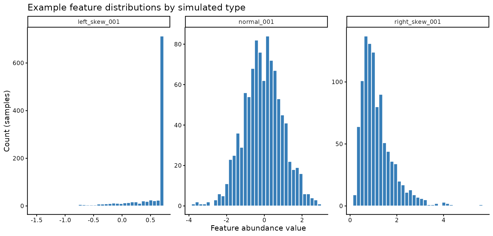
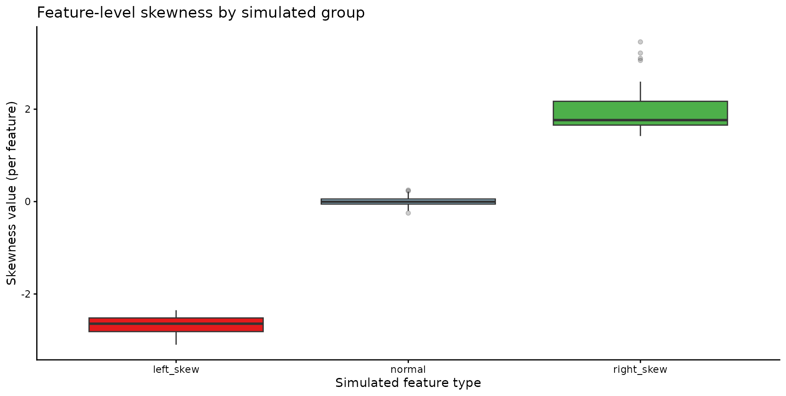
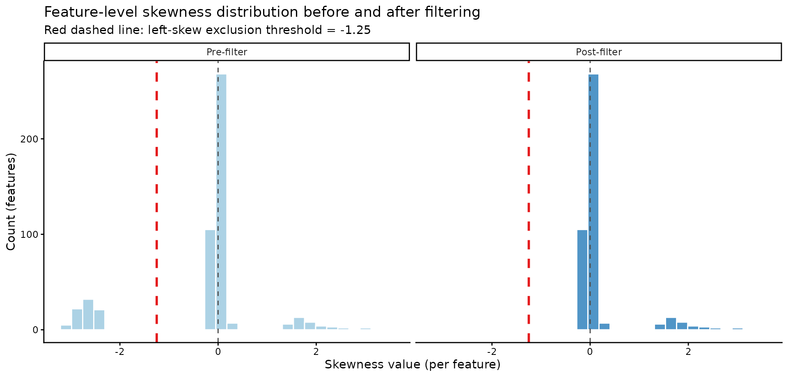
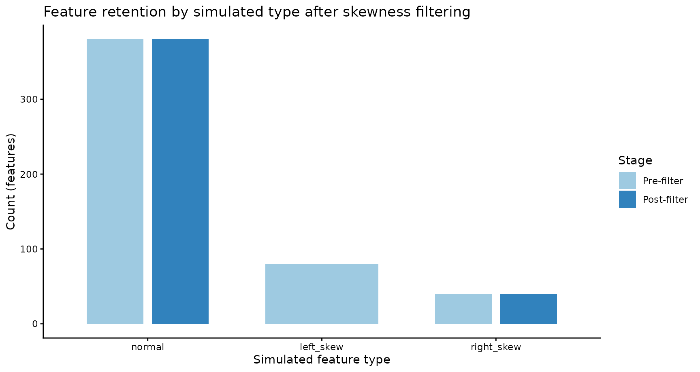
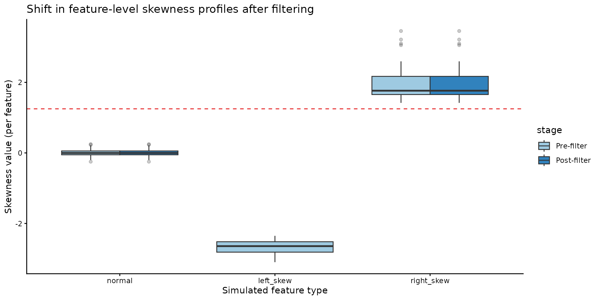

# Skewness-Based Feature QC

## Upper limit of quantification (skewness)

Some measurement platforms have upper limits of quantification which can
result in skewed data with ceiling effects. In this vignette we:

1.  simulate a dataset (`1000` samples x `500` features),
2.  show 3 feature types (normal, left-skew, right-skew),
3.  explain what skewness means,
4.  run skewness filtering in
    [`quality_control()`](https://mrcieu.github.io/omiprep/reference/quality_control.md),
5.  and visualize pre/post filtering impact.

``` r
library(omiprep)
library(ggplot2)

set.seed(20260408)
```

## 1) Simulate Data (1000 Samples x 500 Features)

We create 3 feature groups:

- `normal`: approximately symmetric distributions,
- `left_skew`: features with upper-end truncation (mimicking ceiling
  effects),
- `right_skew`: positively skewed features.

``` r
n_samples <- 1000
n_normal <- 380
n_left_skew <- 80
n_right_skew <- 40
stopifnot(n_normal + n_left_skew + n_right_skew == 500)

# 1) approximately symmetric features
normal_block <- matrix(
  rnorm(n_samples * n_normal, mean = 0, sd = 1),
  nrow = n_samples,
  ncol = n_normal
)

# 2) left-skew features generated via upper-end truncation
left_raw <- matrix(
  rnorm(n_samples * n_left_skew, mean = 1.2, sd = 0.9),
  nrow = n_samples,
  ncol = n_left_skew
)
upper_limit <- 0.7
left_skew_block <- pmin(left_raw, upper_limit)

# 3) right-skew features
right_block <- matrix(
  rlnorm(n_samples * n_right_skew, meanlog = 0, sdlog = 0.55),
  nrow = n_samples,
  ncol = n_right_skew
)

data <- cbind(normal_block, left_skew_block, right_block)

colnames(data) <- c(
  paste0("normal_", sprintf("%03d", seq_len(n_normal))),
  paste0("left_skew_", sprintf("%03d", seq_len(n_left_skew))),
  paste0("right_skew_", sprintf("%03d", seq_len(n_right_skew)))
)
rownames(data) <- paste0("sample_", seq_len(n_samples))

samples <- data.frame(sample_id = rownames(data))
features <- data.frame(
  feature_id = colnames(data),
  simulated_group = c(
    rep("normal", n_normal),
    rep("left_skew", n_left_skew),
    rep("right_skew", n_right_skew)
  )
)
```

Representative distributions for one feature from each group:

``` r
inspect_features <- c("normal_001", "left_skew_001", "right_skew_001")
plot_df <- data.frame(
  feature = rep(inspect_features, each = n_samples),
  value = as.vector(data[, inspect_features, drop = FALSE])
)

ggplot(plot_df, aes(x = value)) +
  geom_histogram(bins = 35, fill = "#377EB8", color = "white") +
  facet_wrap(~feature, scales = "free", nrow = 1) +
  theme_classic() +
  labs(
    x = "Feature abundance value",
    y = "Count (samples)",
    title = "Example feature distributions by simulated type"
  )
```



This is the key motivation: some individual **features** have visibly
skewed distributions. In the above we can see how the distribution of
feature `001` changes based on the simulation; we will focus on the
`left_skew` data.

## 2) What skewness means (per feature)

`omiprep` computes skewness **for each feature across samples** using
[`psych::describe()`](https://rdrr.io/pkg/psych/man/describe.html) and
takes the `skew` column (default `type = 3` in
[`psych::skew`](https://rdrr.io/pkg/psych/man/skew.html)):

$${skew} = \frac{\sum\limits_{i = 1}^{n}\left( x_{i} - \bar{x} \right)^{3}}{n \cdot s^{3}}$$

where $x_{i}$ are sample values for one feature, $\bar{x}$ is the
feature mean, $s$ is the feature SD, and $n$ is the number of
non-missing sample values.

Plain-language interpretation:

- `skew < 0` (`left_skew`): most values are concentrated on the right
  side, with a tail extending to the left.
- `skew > 0` (`right_skew`): most values are concentrated on the left
  side, with a tail extending to the right.
- larger `abs(skew)` means stronger asymmetry.

### What the threshold means

The threshold is a **cutoff on skewness magnitude**, not a p-value.

- With `direction = "left"`, a feature is excluded if
  `skew <= -threshold`.
- With `direction = "right"`, a feature is excluded if
  `skew >= threshold`.
- With `direction = "both"`, a feature is excluded if
  `abs(skew) >= threshold`.

So for `threshold = 1.25` and `direction = "left"`, features with
skewness `<= -1.25` are flagged/excluded.

The helper
[`feature_skewness()`](https://mrcieu.github.io/omiprep/reference/feature_skewness.md)
returns one row per feature:

``` r
skew_df <- feature_skewness(
  data = data,
  threshold = 1.25,
  direction = "left"
)
skew_df$simulated_group <- features$simulated_group[match(skew_df$feature_id, features$feature_id)]

head(skew_df[order(skew_df$skew), ], 10)
#>        feature_id      skew exclude_by_skewness simulated_group
#> 384 left_skew_004 -3.097501                TRUE       left_skew
#> 390 left_skew_010 -3.085930                TRUE       left_skew
#> 392 left_skew_012 -3.056769                TRUE       left_skew
#> 382 left_skew_002 -3.020733                TRUE       left_skew
#> 388 left_skew_008 -3.009804                TRUE       left_skew
#> 383 left_skew_003 -2.941145                TRUE       left_skew
#> 439 left_skew_059 -2.936271                TRUE       left_skew
#> 389 left_skew_009 -2.934770                TRUE       left_skew
#> 429 left_skew_049 -2.929402                TRUE       left_skew
#> 447 left_skew_067 -2.927903                TRUE       left_skew
```

Skewness distributions by simulated group; we can see that the normally
distributed features are mostly around `skew = 0`, the left-skewed
features have negative skewness values (many below `-1.25`), and the
right-skewed features have positive skewness values.

``` r
ggplot(skew_df, aes(x = simulated_group, y = skew, fill = simulated_group)) +
  geom_boxplot(outlier.alpha = 0.25) +
  theme_classic() +
  scale_fill_manual(values = c(
    normal = "#9ECAE1",
    left_skew = "#E41A1C",
    right_skew = "#4DAF4A"
  )) +
  guides(fill = "none") +
  labs(
    x = "Simulated feature type",
    y = "Skewness value (per feature)",
    title = "Feature-level skewness by simulated group"
  )
```



## 3) Apply a skewness filtering rule

To keep this vignette fast while using `1000 x 500` data, we apply the
same feature-level rule directly:

``` r

skew_rule <- feature_skewness(
  data = data,
  threshold = 1.25,
  direction = "left"
)

excluded_skew <- skew_rule$feature_id[skew_rule$exclude_by_skewness %in% TRUE]
```

How many features are excluded by skewness?

``` r
length(excluded_skew)
#> [1] 80
head(excluded_skew, 20)
#>  [1] "left_skew_001" "left_skew_002" "left_skew_003" "left_skew_004"
#>  [5] "left_skew_005" "left_skew_006" "left_skew_007" "left_skew_008"
#>  [9] "left_skew_009" "left_skew_010" "left_skew_011" "left_skew_012"
#> [13] "left_skew_013" "left_skew_014" "left_skew_015" "left_skew_016"
#> [17] "left_skew_017" "left_skew_018" "left_skew_019" "left_skew_020"
```

Exclusions by simulated feature type:

``` r
excluded_tbl <- data.frame(feature_id = excluded_skew)
excluded_tbl$simulated_group <- features$simulated_group[match(excluded_tbl$feature_id, features$feature_id)]
table(excluded_tbl$simulated_group, useNA = "ifany")
#> 
#> left_skew 
#>        80
```

``` r
m <- Omiprep(data = data, samples = samples, features = features)

m_qc <- quality_control(
  omiprep = m,
  source_layer = "input",
  sample_missingness = 0.2,
  feature_missingness = 0.2,
  feature_skewness_threshold = 1.25,
  feature_skewness_direction = "left",
  total_peak_area_sd = NA,
  outlier_udist = 5,
  pc_outlier_sd = NA, 
  cores = 2, 
  fast = FALSE
)
#> 
#> ── Starting Omics QC Process ───────────────────────────────────────────────────
#> ℹ Validating input parameters
#> 
#> ℹ Validating input parameters── Starting 'Omics QC Process ──────────────────────────────────────────────────
#> ℹ Validating input parameters✔ Validating input parameters [24ms]
#> 
#> ℹ Validating input parameters
#> ✔ Validating input parameters [17ms]
#> 
#> ℹ Sample & Feature Summary Statistics for raw data
#> AF =  3
#> ✔ Sample & Feature Summary Statistics for raw data [37.4s]
#> 
#> ℹ Copying input data to new 'qc' data layer
#> ✔ Copying input data to new 'qc' data layer [38ms]
#> 
#> ℹ Assessing for extreme sample missingness >=80% - excluding 0 sample(s)
#> ✔ Assessing for extreme sample missingness >=80% - excluding 0 sample(s) [34ms]
#> 
#> ℹ Assessing for extreme feature missingness >=80% - excluding 0 feature(s)
#> ✔ Assessing for extreme feature missingness >=80% - excluding 0 feature(s) [32m…
#> 
#> ℹ Assessing for sample missingness at specified level of >=20% - excluding 0 sa…
#> ✔ Assessing for sample missingness at specified level of >=20% - excluding 0 sa…
#> 
#> ℹ Assessing for feature missingness at specified level of >=20% - excluding 0 f…
#> ✔ Assessing for feature missingness at specified level of >=20% - excluding 0 f…
#> 
#> ℹ Assessing for feature skewness at threshold <= -1.25 - excluding 0 feature(s)
#> ✔ Assessing for feature skewness at threshold <= -1.25 - excluding 80 feature(s…
#> 
#> ℹ Running sample data PCA outlier analysis at +/- 5 Sdev
#> ✔ Running sample data PCA outlier analysis at +/- 5 Sdev [27ms]
#> 
#> ℹ Creating final QC dataset...
#> AF =  6
#> 
#> ℹ Creating final QC dataset...── Step timings ──
#> ℹ Creating final QC dataset...
#> ℹ Creating final QC dataset...
#>                         step seconds   pct
#>                   validation    0.03   0.0
#>                summarise_raw   37.41  57.6
#>                   copy_layer    0.02   0.0
#>   extreme_sample_missingness    0.01   0.0
#>  extreme_feature_missingness    0.02   0.0
#>           sample_missingness    0.01   0.0
#>          feature_missingness    0.29   0.4
#>              summarise_final   26.98  41.5
#>                        total   64.97 100.0
#> ✔ Creating final QC dataset... [27s]
#> 
#> ℹ 'Omics QC Process Completed
#> ✔ 'Omics QC Process Completed [13ms]
```

## 4) Post-filtering impact on distributions

All plots below are feature-level summaries (counting features), except
where explicitly stated.

``` r
included_features <- setdiff(colnames(data), excluded_skew)

pre_skew <- feature_skewness(data, threshold = NULL)

post_matrix <- data[, included_features, drop = FALSE]
post_skew <- feature_skewness(post_matrix, threshold = NULL)

pre_skew$stage  <- factor("Pre-filter",  levels = c("Pre-filter", "Post-filter"))
post_skew$stage <- factor("Post-filter", levels = c("Pre-filter", "Post-filter"))
skew_compare <- rbind(
  pre_skew[, c("feature_id", "skew", "stage")],
  post_skew[, c("feature_id", "skew", "stage")]
)
```

### 4a) Feature-skewness distribution before vs after filtering

``` r
params_used <- attributes(m_qc@data)
skewness_threshold <- ifelse(params_used$qc_feature_skewness_direction=="left", 
                             -1 * params_used$qc_feature_skewness_threshold, 
                              1 * params_used$qc_feature_skewness_threshold)

ggplot(skew_compare, aes(x = skew, fill = stage)) +
  geom_histogram(bins = 30, color = "white", alpha = 0.85) +
  facet_wrap(~stage, nrow = 1) +
  geom_vline(xintercept = 0, color = "#4D4D4D", linetype = "dashed") +
  geom_vline(xintercept = skewness_threshold, color = "#E41A1C", linetype = "dashed", linewidth = 1) +
  theme_classic() +
  scale_fill_manual(values = c("Pre-filter" = "#9ECAE1", "Post-filter" = "#3182BD")) +
  guides(fill = "none") +
  labs(
    x = "Skewness value (per feature)",
    y = "Count (features)",
    title = "Feature-level skewness distribution before and after filtering",
    subtitle = paste0("Red dashed line: left-skew exclusion threshold = ", skewness_threshold)
  )
```



### 4b) Feature retention by simulated type

``` r
pre_counts <- as.data.frame(table(features$simulated_group), stringsAsFactors = FALSE)
names(pre_counts) <- c("simulated_group", "n")
pre_counts$stage <- factor("Pre-filter",  levels = c("Pre-filter", "Post-filter"))

post_counts <- as.data.frame(table(features$simulated_group[features$feature_id %in% included_features]), stringsAsFactors = FALSE)
names(post_counts) <- c("simulated_group", "n")
post_counts$stage <- factor("Post-filter",  levels = c("Pre-filter", "Post-filter"))

counts_df <- rbind(pre_counts, post_counts)
counts_df$simulated_group <- factor(counts_df$simulated_group, levels = c("normal", "left_skew", "right_skew"))

ggplot(counts_df, aes(x = simulated_group, y = n, fill = stage)) +
  geom_col(position = position_dodge(width = 0.75), width = 0.65) +
  theme_classic() +
  scale_fill_manual(values = c("Pre-filter" = "#9ECAE1", "Post-filter" = "#3182BD"), drop = FALSE) +
  labs(
    x = "Simulated feature type",
    y = "Count (features)",
    fill = "Stage",
    title = "Feature retention by simulated type after skewness filtering"
  )
```



### 4c) Skewness profiles by feature type (pre vs post)

``` r
pre_plot <- merge(pre_skew, features, by = "feature_id", all.x = TRUE)
post_plot <- merge(post_skew, features, by = "feature_id", all.x = TRUE)
box_df <- rbind(
  data.frame(stage = "Pre-filter", simulated_group = pre_plot$simulated_group, skew = pre_plot$skew),
  data.frame(stage = "Post-filter", simulated_group = post_plot$simulated_group, skew = post_plot$skew)
)
box_df$stage <- factor(box_df$stage,  levels = c("Pre-filter", "Post-filter"))

box_df$simulated_group <- factor(box_df$simulated_group, levels = c("normal", "left_skew", "right_skew"))

ggplot(box_df, aes(x = simulated_group, y = skew, fill = stage)) +
  geom_boxplot(outlier.alpha = 0.25, position = position_dodge(width = 0.75)) +
  geom_hline(yintercept = -skewness_threshold, color = "#E41A1C", linetype = "dashed") +
  theme_classic() +
  scale_fill_manual(values = c("Pre-filter" = "#9ECAE1", "Post-filter" = "#3182BD")) +
  labs(
    x = "Simulated feature type",
    y = "Skewness value (per feature)",
    title = "Shift in feature-level skewness profiles after filtering"
  )
```


